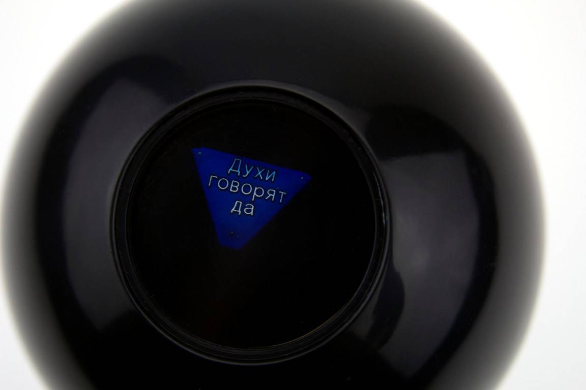

# Мини игра - шар судьбы 

мини игра которая случайно отвечает 1 из 20 вариантов.

Варианты ответов:

- "Бесспорно" - "Мне кажется - да" - "Вероятнее всего" - "Хорошие перспективы"
- "Предрешено" - "Знаки говорят - да" - "Да" - "Пока неясно, попробуй снова"
- "Никаких сомнений" - "Спроси позже" - "Лучше не рассказывать" - "Сейчас нельзя предсказать"
- "Определённо да" - "Сконцентрируйся и спроси опять" - "Даже не думай" - "Мой ответ - нет"
- "Можешь быть уверен в этом" - "По моим данным - нет" - "Перспективы не очень хорошие" - "Весьма сомнительно"

   
